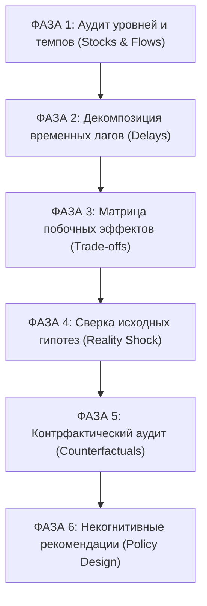

# Методология системного аудита и оценки партий в ИИ: Как интерпретировать экспорт Лоххаузена в Claude, Gemini и Codex по канонам Дёрнера и Стермана

**Автор**: `agy` (Antigravity Research Assistant / Domain Expert)  
**Дата**: 2026-09-12  
**Основание**: Дитрих Дёрнер (*Die Logik des Mißlingens*, 1989), Джон Стерман (*Learning in and about complex systems*, 1994), математическая модель `src/model.js` и движок `src/debrief.js`  
**Назначение**: Научно-методическое руководство для пользователей и разработчиков по интерпретации результатов экспорта партий (`copy-ai-prompt`, `export-debrief-ai-md`, LMN v1.2) во внешних языковых моделях (Claude 3.5 Sonnet / Opus, Google Gemini 1.5 Pro / Ultra, OpenAI GPT-4o / o1, Codex).

---

## 1. Введение: Почему наивный анализ ИИ опасен в сложных системах?

С внедрением функционала экспорта системного промпта (`ai-prompt-export-001`) любой игрок может в один клик скопировать историю своей партии и передать ее передовой LLM.

Однако исследования Джона Стермана в MIT Sloan School of Management (1994) и Дитриха Дёрнера в Бамбергском университете (1983–1989) доказали:
> **Любой интеллектуальный агент (человек или языковая модель), не обученный явно принципам системной динамики, неизбежно генерирует поверхностные, линейные и разрушительные рекомендации.**

### Типичные ошибки («галлюцинации здравого смысла») стандартных LLM:

1. **Иллюзия фискального баланса**:
   - *Совет LLM*: «У вас дефицит бюджета -40 тыс. марок! Срочно поднимите налог с 10% до 18%, чтобы пополнить казну».
   - *Системная реальность `src/model.js`*:
     $$\text{taxPenalty} = \max(0, 18 - 10) \cdot 1.5 = 12\text{ п.п.}$$
     Удовлетворенность падает ниже 85% $\implies$ начинается эмиграция $\implies$ население падает $\implies$ налоговая база сжимается $\implies$ доходы казны через 12 месяцев становятся еще меньше, чем до повышения налогов!
2. **Иллюзия экономии на обслуживании**:
   - *Совет LLM*: «Сократите расходы на обслуживание оборудования фабрики до нуля, чтобы переждать кризис ликвидности».
   - *Системная реальность*: Станки теряют по $0.0003 \cdot P$ в месяц. При падении оборудования ниже 40% производительность падает, выпуск снижается, выручка фабрики обваливается, город берет автоматический кредит под 8% годовых, попадая в долговую спираль.
3. **Иллюзия рекламного рычага**:
   - *Совет LLM*: «Увеличьте маркетинг туризма до 50 тыс. марок, чтобы привлечь туристов».
   - *Системная реальность*: При емкости гостиниц в 20 мест (до завершения стройки) выручка ограничена $20 \cdot 0.19 = 3.8$ тыс. марок. Город сжигает $50 - 3.8 = 46.2$ тыс. марок ежемесячно.
4. **Иллюзия технологического триумфа**:
   - *Совет LLM*: «Поздравляю, ваши станки достигли 100%, вы блестящий хозяйственник!».
   - *Системная реальность*: Рост производительности до $\text{productivity}=1.0$ сократил потребность в рабочих местах с 1182 до 1113, породив 69 новых безработных, падение удовлетворенности и волну эмиграции при ничтожном финансовом выигрыше (+1.88 тыс. за 45 месяцев).

---

## 2. Шестифазный протокол системного аудита партии (Systemic Audit Protocol)

Чтобы внешняя языковая модель провела глубокий, дидактически полезный разбор, анализ должен строго следовать 6 фазам:

---

### Фаза 1. Аудит фондов (Stocks) и потоков (Flows)

В системной динамике уровни (накопители) обладают инерцией, а потоки меняются мгновенно. ИИ обязан сопоставить:
- **Фонд оборудования** ($E$): изменяется со скоростью $\frac{dE}{dt} = \Delta_{\text{mod}} - 0.0003 \cdot P$.
- **Фонд жилья** ($C$): изменяется со скоростью $\frac{dC}{dt} = \Delta_{\text{house}} = +60$ через 12 месяцев.
- **Фонд муниципального долга** ($D$): растет на $D \cdot \frac{0.08}{12}$ в месяц при дефиците казны.
- **Фонд доверия/удовлетворенности** ($S$): определяет миграционный поток $\frac{dPop}{dt} = (S - 85) \cdot 0.35$.

*Вопрос аудита*: Создавали ли решения игрока накопительный скрытый дефицит фондов при видимом благополучии потоков?

---

### Фаза 2. Декомпозиция временных задержек (Time Lags)

Игрок часто страдает «слепотой к задержкам», считая, что результаты наступают сразу. ИИ обязан разложить хронику по каноническим лагам:
- **Лаг жилья**: 12 месяцев от старта до ввода $+60$ мест.
- **Лаг модернизации**: 9 месяцев от старта до ввода $+12$ пунктов оборудования.
- **Лаг туризма**: 6 месяцев от старта до ввода $+80$ мест размещения.
- **Лаг демографической инерции**: миграционный отклик на изменение удовлетворенности созревает за 3–6 месяцев.

*Вопрос аудита*: Не принимал ли игрок судорожных мер коррекции (например, налогов) до того, как успели проявиться отложенные эффекты предыдущих инвестиций?

---

### Фаза 3. Матрица побочных эффектов и компромиссов (Trade-offs)

ИИ обязан исследовать перекрестные связи между подсистемами:
1. **Промышленность $\leftrightarrow$ Труд**:
   - Рост оборудования $\implies$ рост производительности $\implies$ падение потребности в рабочих местах при ограниченном спросе $\implies$ технологическая безработица.
2. **Финансы $\leftrightarrow$ Демография**:
   - Рост налогов $\implies$ рост сиюминутных доходов $\implies$ штраф удовлетворенности $\implies$ эмиграция $\implies$ сжатие налоговой базы.
3. **Туризм $\leftrightarrow$ Бюджет**:
   - Маркетинг без гостиничной емкости $\implies$ чистый отток ликвидности в никуда.

---

### Фаза 4. Сверка гипотез (Reality Shock)

ИИ анализирует поле `note` в журнале партии:
- Что игрок планировал достичь в момент $T_{\text{start}}$?
- Каково было фактическое состояние системы в момент $T_{\text{complete}}$?
- Запрашивал ли игрок отчеты (`report`) во время строительства или действовал вслепую (баллистическое поведение)?

*Критерий оценки*:
- Если расхождение прогноза и факта $>30\%$, ИИ фиксирует когнитивное искажение и показывает системный контур, нарушивший прогноз.

---

### Фаза 5. Контрфактический аудит (Counterfactual Audit)

ИИ опирается на данные контрфактического анализа (`src/counterfactual.js`):
- Какова была истинная цена отказа от проекта?
- Оправдались ли затраты ликвидности?
- Не было ли альтернативное состояние системы без проекта более гармоничным (выше удовлетворенность, ниже безработица)?

---

### Фаза 6. Конструктивные рекомендации (Policy Design)

ИИ запрещено давать шаблонные советы («играйте осторожнее», «повышайте эффективность»). Рекомендации обязаны быть:
1. **Структурными**: указание конкретных обратных связей и порогов.
2. **Многокритериальными**: учет баланса всех 5 осей системного радара.
3. **Упреждающими**: подготовка резервов ликвидности за 6–12 месяцев до начала кризиса.

---

## 3. Чек-лист для проверки ИИ-разборов (Анти-галлюцинация)

| Утверждение в ответе ИИ | Квалификация | Корректное системное объяснение |
|:---|:---:|:---|
| «Повысьте налог до 20%, чтобы закрыть долг» | ❌ **Галлюцинация** | Вызовет штраф удовлетворенности $-15$ п.п., бегство населения и фискальный коллапс. |
| «Обнулите обслуживание оборудования» | ❌ **Галлюцинация** | Вызовет прогрессирующий износ станков, падение выпуска и технологический паралич. |
| «Вложите 60k в рекламу туризма» | ❌ **Галлюцинация** | Без предварительного ввода гостиниц емкость ограничит доход до 3.8k/мес. (убыток 56.2k/мес.). |
| «Рост безработицы вызван модернизацией» | ✅ **Верно** | Прирост производительности труда при стабильном спросе сокращает потребность в рабочей силе. |
| «Долг накапливается под сложные 8%» | ✅ **Верно** | Проценты капитализируются ежемесячно, требуя первоочередного гашения долга. |

---

## 4. Резюме для практического применения

Системный экспорт Лоххаузена — это не просто выгрузка логов, а **высокоточный когнитивный интерфейс**. Применение настоящей методологии превращает любой внешний ИИ (Claude, Gemini, Codex) из генератора банальностей в строгого системного наставника по методологии Дитриха Дёрнера.
