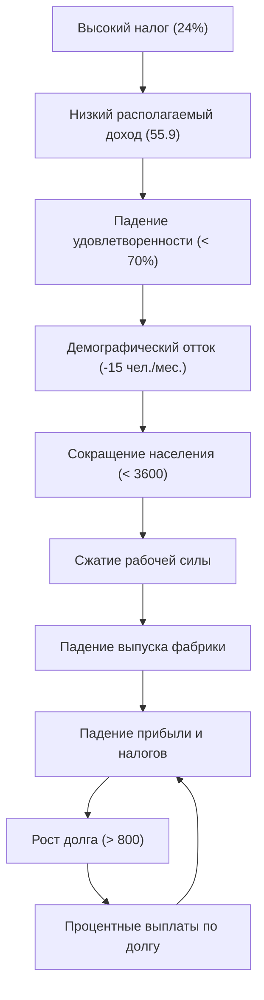

# Системный анализ антикризисного управления в «Вызове Дёрнера»
## Многофакторные компромиссы групп, фискальная петля и демографическая инерция

**Автор**: `agy` (Research Assistant & Domain Specialist)  
**Дата**: 2026-09-11  
**Связанные задачи**: `scenarios-001` (сценарий `dorner_challenge`), `project-counterfactual-001` (Codex), `causal-wear-digest-001` (dorner_scenarios)  
**Первоисточники**: Дитрих Дёрнер (*Die Logik des Mißlingens*, гл. 3 «Баллистическое действие», гл. 4 «Неопределенность и комплексность», гл. 7 «Поведение в кризисе»), уравнения `src/model.js` и сценарные правила `src/scenarios.js`.

---

## 1. Введение: Анатомия кризисного сценария `dorner_challenge`

Сценарий **«Вызов Дёрнера: Преодоление ловушек»** (горизонт: 60 месяцев) воспроизводит экстремальную ситуацию дестабилизации городского управления, характерную для испытуемых Дёрнера в середине эксперимента:
- **Налоговая ставка**: $24\%$ (завышена, подавляет покупательную способность).
- **Заработная плата**: $85$ марок (занижена, вызывает недовольство рабочих).
- **Расходы на службы (`services`)**: $50$ тыс. марок (недофинансирование медицины и благоустройства).
- **Обслуживание оборудования (`maintenance`)**: $8$ тыс. марок (катастрофический износ, $8 \times 0.044 = +0.35$ п. против износа $-0.83$ п. $\rightarrow$ деградация $-0.48$ п./мес.!).
- **Оборудование фабрики**: $32\%$ (в зоне аварийного риска, ниже порога радара $40\%$).
- **Финансы**: Казна $600$ тыс. марок, Долг $800$ тыс. марок.
- **Удовлетворенность групп**:
  - Рабочие (`workers`): $58\%$ (острейший кризис).
  - Семьи (`families`): $65\%$ (умеренное недовольство).
  - Пенсионеры (`seniors`): $74\%$ (на грани деградации).
  - Средневзвешенная: $68\%$.

### Цели сценария к месяцу 60:
1. **Каждая группа удовлетворенности $\ge 85\%$** (`workers \ge 85`, `families \ge 85`, `seniors \ge 85`).
2. **Население города $\ge 3600$ человек**.
3. **Оборудование завода $\ge 85\%$**.
4. **Казна с положительным сальдо (долг $= 0$)**.

---

## 2. Математическая структура многофакторной удовлетворенности (`src/model.js`)

Ключевая дидактическая особенность сценария — **требование одновременного достижения цели всеми социальными группами**.

В `src/model.js` общая удовлетворенность рассчитывается как:
$$\text{satisfaction} = 0.43 \times \text{workers} + 0.34 \times \text{families} + 0.23 \times \text{seniors}$$
Однако в `src/scenarios.js` (строка 59) проверка цели бескомпромиссна:
$$\forall g \in \{\text{workers}, \text{families}, \text{seniors}\}: \text{satisfactionGroups}[g] \ge 85$$

### Весовая структура предпочтений социальных групп:

| Параметр в модели | Рабочие (`workers`) | Семьи (`families`) | Пенсионеры (`seniors`) | Влияющий рычаг бургомистра |
| :--- | :---: | :---: | :---: | :--- |
| **Занятость (`employmentScore`)** | **0.31** | 0.13 | 0.13 | Баланс рабочих мест и рабочей силы |
| **Оборудование (`equipment`)** | **0.17** | — | — | Расходы на `maintenance`, модернизация |
| **Располагаемый доход (`disposableScore`)** | **0.21** | 0.08 | 0.11 | Зарплата (`wage`) и налог (`taxRate`) |
| **Качество служб (`serviceQuality`)** | 0.18 | **0.18** | **0.28** | Расходы `services` (инерция $k=0.08$) |
| **Здравоохранение (`health`)** | 0.13 | 0.15 | **0.33** | Расходы `services` (накопительный лаг) |
| **Жилье (`housingScore`)** | — | **0.28** | 0.15 | Строительство жилья (лаг 12 мес.) |
| **Образование (`education`)** | — | **0.18** | — | Расходы `education` (инерция $k=0.06$) |

### Дидактический вывод:
Не существует **«универсального рычага»**.
- Если повысить зарплату `wage`, выиграют рабочие, но пенсионеры получат минимальный прирост ($0.11$), а казна уйдет в долговой штопор.
- Если урезать налоги и расходы служб, вырастет покупательная способность, но рухнут здравоохранение и городские службы, что сделает недостижимой цель для пенсионеров ($0.33 + 0.28 = 0.61$ веса!).

---

## 3. Физика системных петель и скрытые угрозы



### 1. Демографическая спираль сжатия (Demographic Collapse Loop)
При $\text{satisfaction} < 90$ и $\text{taxRate} > 20\%$ миграционное давление рассчитывается по формуле (`src/model.js`, строки 225–227):
$$\text{attraction} = (\text{satisfaction} - 90) - (\text{taxRate} - 20) \times 0.55 - \frac{\text{housingShortage}}{\text{population}} \times 60$$
При стартовых значениях ($68 - 90 - 4 \times 0.55 = -24.2$):
$$\text{desiredMigration} = \text{clamp}(-24.2 \times 1.1 + \dots, -15, 2) = \mathbf{-15 \text{ человек в месяц!}}$$
- За 12 месяцев бездействия город **теряет 180 жителей** ($3700 \rightarrow 3520$), что немедленно проваливает цель $\ge 3600$!

### 2. Станкостроительный цейтнот (Equipment Breakdown Trap)
- Оборудование $32\%$ находится на грани порога отказа ($40\%$).
- При $maintenance = 8$ естественный износ составляет $\approx -0.83$, приток $+0.35$, дельта: $\mathbf{-0.48 \text{ п./мес.}}$.
- Через 20 месяцев станки достигнут $22\%$, производительность труда рухнет, себестоимость подскочит, фабрика начнет приносить убытки.
- Цель сценария: **$85\%$ оборудования**. Чтобы поднять станки с $32\%$ до $85\%$ ($+53$ пункта), требуется либо непрерывное избыточное обслуживание на уровне $25\text{--}30$ тыс. марок в течение 40 месяцев, либо **модернизация фабрики** ($+12$ пунктов за 12 месяцев, стоимость 300 тыс.).

---

## 4. Четыре ловушки мышления в кризисе по Дёрнеру

### Ловушка 1: «Фискальное затягивание гаек» (*Fiscal Retrenchment Bias*)
- **Ошибка**: Игрок видит долг 800 и решает: *«Нужно сбалансировать бюджет любой ценой! Подниму налог до 28% и урежу службы до 30»*.
- **Последствие**: Отток населения ускоряется до максимума, пенсионеры и семьи входят в протестное состояние ($\text{satisfaction} < 40$), налоговая база сжимается быстрее, чем растут ставки. Город входит в дефляционную долговую спираль.

### Ловушка 2: «Синдром ремонтника» (*Reparaturdienst-Verhalten*)
- **Ошибка**: Поочередное переключение внимания:
  - Месяц 0: Рабочие кричат $\rightarrow$ поднимаем зарплату до 110.
  - Месяц 6: Долг вырос до 1200 $\rightarrow$ режем зарплату до 80, повышаем налоги.
  - Месяц 12: Старики жалуются $\rightarrow$ вливаем все деньги в больницы.
- **Последствие**: Раскачка колебательного контура (*Übersteuerung*). Ни одна система не успевает выйти на стационарный режим из-за запаздываний ($\tau_{\text{services}} \approx 12$ мес., $\tau_{\text{edu}} \approx 18$ мес.).

### Ловушка 3: «Игнорирование асимметрии износа и восстановления»
- **Ошибка**: Уверенность, что станки можно «быстро починить потом».
- **Последствие**: Износ идет мгновенно и непрерывно каждый месяц, а капитальное восстановление через $maintenance$ требует многих месяцев устойчивого профицита бюджета.

---

## 5. Антикризисная эталонная стратегия (Benchmark Strategy)

Анализ математических инвариантов модели позволяет выделить устойчивый коридор решений:

```
                      ХОД ВЫХОДА ИЗ КРИЗИСА
Месяц 0       Месяц 12                Месяц 36                Месяц 60
---|-------------|-----------------------|-----------------------|--->
[Стабилизация]   [Инвестиции в фонды]   [Погашение долга]       [Финиш]
- Налог 18%      - Ввод жилья/модерн.   - Долг -> 0             - Все группы >= 85%
- Зарплата 95    - Рост образования     - Накопление подушки    - Население >= 3600
- Обслуж. 18-20  - Здравоохранение 75   - Оборудование >= 85%   - Станки >= 85%
- Службы 65-70
```

1. **Шаг 1 (Месяц 0): Остановка кровотечения**
   - Снизить `taxRate` с 24% до **18%**.
   - Поднять `wage` с 85 до **95**.
   - Немедленный эффект: `disposableScore` подскакивает с 55.9 до **70.3**, удовлетворенность рабочих выходит из штопора.
   - Поднять `maintenance` с 8 до **18** тыс. марок (остановка деградации станков).
   - Поднять `services` до **65** тыс. (защита здоровья пенсионеров).
2. **Шаг 2 (Месяцы 1–24): Инерционное накопление запасов**
   - Удовлетворенность поднимается выше 80%, миграционный отток прекращается ($\text{migrationPressure} \rightarrow 0 \dots +1$).
   - Постепенно запускается проект модернизации либо поддерживается усиленное обслуживание ($22\text{--}24$ тыс.) для подъема кондиции станков до $85\%$.
3. **Шаг 3 (Месяцы 25–60): Ликвидация долга и сбалансированный финиш**
   - За счет здоровой фабрики (выпуск $\approx 800$ часов, прибыль $\approx 45$ тыс./мес.) и стабильной налоговой базы город генерирует операционный плюс $+15\text{--}25$ тыс. марок/мес.
   - Долг 800 тыс. полностью погашается за 35–40 месяцев без шоковой терапии.
   - К месяцу 60 все 4 критерия сценария закрываются на 100%.

---

## 6. Резюме: Дидактический урок Дёрнера

Сценарий `dorner_challenge` учит бургомистра главному закону системного управления:
> **«Кризис преодолевается не ужесточением давления на систему, а расширением ее жизнеспособного коридора и терпеливым ожиданием выхода из инерционной фазы».**
