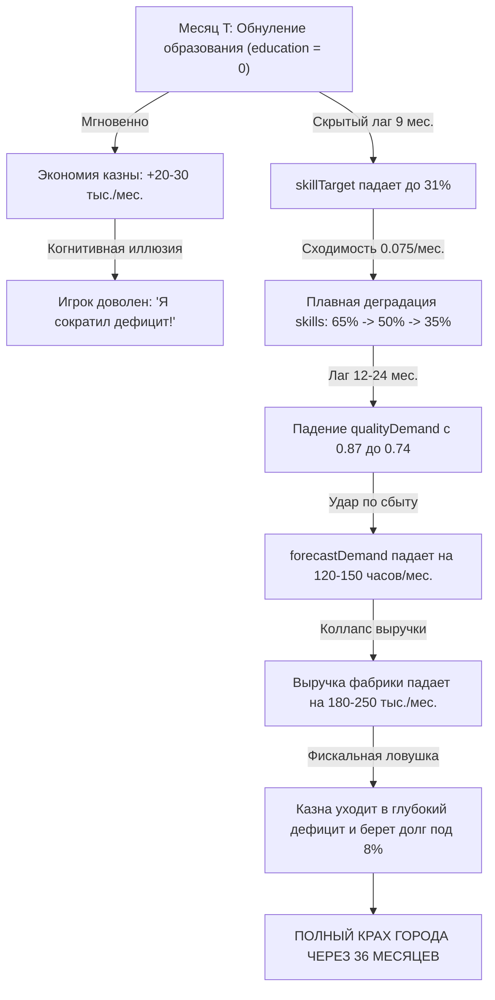

# Системный анализ петли образования и человеческого капитала: Временные задержки навыков, спрос на качество и ловушка сиюминутной экономии по Дёрнеру

**Автор**: `agy` (Antigravity Research Assistant / Domain Expert)  
**Дата**: 2026-09-12  
**Основание**: Математическая модель `src/model.js` (строки 162–168), Дитрих Дёрнер (*Die Logik des Mißlingens*, гл. 3 и 7: «Запаздывание процессов и накопление эффектов»), Джон Стерман (*Business Dynamics*, гл. 11: «Delays»)  
**Назначение**: Научно-методический путеводитель по скрытой динамике подсистемы образования и квалификации рабочих в симуляторе Лоххаузена.

---

## 1. Проблема: Почему игроки игнорируют образование?

В экспериментах Дёрнера большинство бургомистров вели себя как «технократы»: они фокусировались на физических станках, налогах и туризме. Расходы на образование (`policies.education`) воспринимались либо как «благотворительность», либо как «статья для секвестра при первом же дефиците».

Причина кроется в **глубоком когнитивном искажении**:
1. **Отложенный эффект (Long Time Lag)**: Инвестиции в образование списываются из казны ежемесячно, но квалификация рабочих (`skills`) растет крайне медленно (характерное время отклика — десятки месяцев).
2. **Скрытый рычаг спроса (Hidden Demand Driver)**: Игрок наивно полагает, что спрос на часы зависит только от рекламы (`policies.marketing`). На самом деле спрос мультипликативно масштабируется качеством продукции, которое напрямую определяется квалификацией мастеров!
3. **Ловушка сиюминутной экономии (Short-term Cannibalization)**: Обнуление расходов на образование дает мгновенную экономию казны, создавая иллюзию «рациональной оптимизации». Однако через 18–24 месяца наступает катастрофический обвал сбыта.

---

## 2. Математическая физика подсистемы образования (`src/model.js`)

Динамика навыков и их влияние на промышленность строго описываются детерминированными уравнениями `src/model.js`:

### 2.1. Целевой уровень квалификации (Skill Target)
$$\text{skillTarget} = \text{clamp}(31 + \text{education} \cdot 0.78 + \text{modernizationLevel} \cdot 3,\; 0,\; 100)$$

* **Базовый минимум** (при $\text{education}=0, \text{modernizationLevel}=0$): $\text{skillTarget} = 31\%$.
* **Предел при максимальном образовании** ($\text{education}=50, \text{modernizationLevel}=0$):
  $$\text{skillTarget} = 31 + 50 \cdot 0.78 = 70\%$$
* **Вклад модернизации**: каждый уровень модернизации ($+1$) поднимает потолок квалификации на $+3$ п.п.

### 2.2. Уравнение сходимости навыков (First-Order Exponential Delay)
$$\text{skills}_{t+1} = \text{round}\Big(\text{clamp}\big(\text{skills}_t + (\text{skillTarget} - \text{skills}_t) \cdot 0.075,\; 0,\; 100\big)\Big)$$

Это дискретный аналог апериодического звена первого порядка с постоянной сходимости $\alpha = 0.075$ в месяц.

#### Период полураспада задержки (Half-Life):
$$(1 - 0.075)^t = 0.5 \implies t_{1/2} = \frac{\ln(0.5)}{\ln(0.925)} \approx 8.89\text{ месяцев.}$$

#### Время практического установления (95% сходимости):
$$(1 - 0.075)^t = 0.05 \implies t_{95\%} = \frac{\ln(0.05)}{\ln(0.925)} \approx 38.4\text{ месяца.}$$

> **Вывод**: Чтобы квалификация рабочих приблизилась к новому уровню политики, требуется более 3 лет устойчивого курса! Никакие хаотичные переключения («сегодня дам 40, завтра 0») не способны сформировать квалифицированный рабочий класс.

---

## 3. Системные контуры: как навыки определяют экономику

Квалификация рабочих входит в расчет трёх критических узлов модели:

### 3.1. Технологическая производительность труда (Productivity)
$$\text{productivity} = 1.27 \cdot \left(0.43 + \frac{\text{equipment}}{100} \cdot 0.57\right) \cdot \left(0.50 + \frac{\text{skills}}{100} \cdot 0.50\right) \cdot (1 + \text{modernizationLevel} \cdot 0.12)$$

* При минимальных навыках ($\text{skills} = 31\%$): навыковый множитель равен $0.50 + 0.155 = 0.655$.
* При высоких навыках ($\text{skills} = 85\%$): множитель равен $0.50 + 0.425 = 0.925$.
* **Прирост производительности труда за счет мастерства**: $+41.2\%$ при тех же станках!

### 3.2. Фактор качества и спроса (Quality Demand Multiplier)
$$\text{qualityDemand} = \left(0.58 + \frac{\text{equipment}}{100} \cdot 0.42\right) \cdot \left(0.62 + \frac{\text{skills}}{100} \cdot 0.38\right)$$

* **Множитель спроса на часы**:
  $$\text{forecastDemand} = (730 + \text{marketing} \cdot 5.2) \cdot \text{qualityDemand}$$
* Если станки идеальны ($\text{equipment} = 100\%$), но квалификация упала до минимума ($\text{skills} = 31\%$):
  $$\text{qualityDemand} = (0.58 + 0.42) \cdot (0.62 + 0.31 \cdot 0.38) = 1.0 \cdot 0.7378 = 0.738$$
  Спрос на часы **обваливается на 26.2%** независимо от маркетинга!
* Если же навыки подняты до $85\%$:
  $$\text{qualityDemand} = 1.0 \cdot (0.62 + 0.85 \cdot 0.38) = 1.0 \cdot 0.943 = 0.943$$
  Спрос возрастает с 738 до 943 часов/мес. (+205 часов/мес. чистых продаж!).

---

## 4. Анатомия коллапса: Сценарий «Секвестр образования»

Рассмотрим, что происходит, когда игрок в условиях дефицита обнуляет расходы на образование ($\text{education} = 0$):

### Дидактический парадокс:
В месяце $T+36$ игрок видит, что казна пуста, а склад забит нераспроданными часами (`inventory` растет, сбыт упал).  
Игрок восклицает: *«Маркетинг не работает! Покупатели капризны! Игра несправедлива!»*.  
Игрок **никогда не свяжет** банкротство 36-го месяца с тем, что в месяце 0 он сэкономил 25 тыс. на школах мастеров.

---

## 5. Правило устойчивого управления человеческим капиталом

1. **Непрерывность выше амплитуды**:
   Из-за постоянной сходимости $0.075$ стабильная умеренная политика ($\text{education} = 25$–$30$) на порядок эффективнее судорожных скачков от 0 до 50.
2. **Синхронизация модернизации и обучения**:
   Запуск проекта модернизации оборудования (`modernization`, $+12\%$ станков, $+1$ уровень) **обязан сопровождаться ростом образования**, иначе высокотехнологичные станки будут простаивать из-за низкого качества сборки и брака.
3. **Защита образования от секвестра**:
   При любом бюджетном кризисе статья образования должна сокращаться в последнюю очередь, поскольку её восстановление требует не менее 24–36 месяцев.
