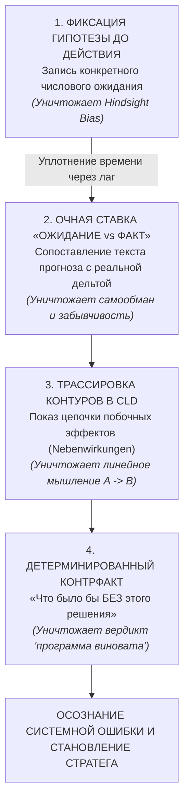

# Психологические барьеры осознания ошибок в сложных системах

**Автор**: `agy` (Antigravity Research Assistant / Domain Expert)  
**Дата**: 2026-09-11  
**Основание**: Дитрих Дёрнер (*«Die Logik des Mißlingens»*, гл. 7 и 8; русский перевод: `main-14.xhtml`, `main-15.xhtml`), исследования Стефана Штрошнайдера (Stefan Strohschneider) и Герхарда Райтера (Gerhard Reiter).  
**Статус**: Фундаментальное научно-методологическое руководство для проекта Лоххаузена.

---

## 1. Главная проблема: почему люди не учатся на своих ошибках?

В главах 7 и 8 своей книги Дитрих Дёрнер задает центральный вопрос: *почему умные, высокообразованные руководители, управляя Лоххаузеном, раз за разом совершают разрушительные системные ошибки и при этом абсолютно искренне не считают себя виновными?*

Дёрнер и его коллега Стефан Штрошнайдер экспериментально описали **защитные когнитивные барьеры**, которые психика выстраивает для защиты базового чувства собственной компетентности (*Gefühl der Kompetenz*):

### Барьер 1. Экстернализация вины («Вредный экспериментатор»)
> *«Неприятные последствия всегда можно атрибутировать другим: „Я хотел только хорошего, но обстоятельства помешали этому произойти!“... или, как в наших экспериментах, вредный экспериментатор, который так запрограммировал систему, что ничего разумного получиться не может».*  
> — Д. Дёрнер, гл. 7, `main-14.xhtml ¶23`

Когда игрок видит, что при 100% исправности станков выросла безработица, его первая реакция — объявить модель «нереалистичной», «глючной» или «несправедливой». Это защита эго от признания того, что он упустил системный побочный эффект.

### Барьер 2. Иммунизирующее маргинальное обусловливание (Штрошнайдер)
> *«Можно защитить собственную компетентность, осуществив „иммунизирующее маргинальное обусловливание“ собственных действий: „Вообще-то мероприятие А всегда дает эффект Б! Однако при определенных обстоятельствах, которые именно сейчас случайно наступили, оно дало другой эффект!“»*  
> — Д. Дёрнер, гл. 7, `main-14.xhtml ¶25`

Человек спасает свою неверную теорию, изобретая ad-hoc оправдания: «Моя стратегия была идеальной, просто туристы случайно не приехали в ноябре».

### Барьер 3. Искажение памяти задним числом (*Hindsight Bias*)
Человеческая память пластична. Столкнувшись с непредвиденным исходом, игрок подсознательно переписывает воспоминание о своих исходных целях: «Да, казна опустела, но я и планировал агрессивные инвестиции, всё идет по плану».

### Барьер 4. Временной разрыв между причиной и следствием (*Time Lags*)
В сложных системах последствия решений проявляются через месяцы или годы. Когда в месяце 25 наступает кризис, игрок связывает его с действиями месяца 24, совершенно не понимая, что истинная причина лежит в решении, принятом в месяце 8.

---

## 2. Что самое важное должно быть в проекте, чтобы пользователь понял свои ошибки?

Чтобы пробить эти четыре барьера психологической защиты, простого вывода статистики, графиков или числового балла в конце игры **принципиально недостаточно**.

По Дёрнеру, для подлинного понимания ошибок необходима **система принудительной объективизации ментальной модели**:

### 1. Явная фиксация гипотезы ДО принятия решения (Pre-decision Hypothesis Logging)
- Перед запуском проекта или крупным изменением налогов игрок обязан (или настойчиво приглашается) сформулировать гипотезу:
  *«Зачем я это делаю? Какой эффект, в каком объеме и через сколько месяцев я ожидаю?»*
- **Дидактический эффект**: Записанную формулировку невозможно исказить задним числом. Это лишает игрока спасительной иллюзии «я так и предполагал».

### 2. Очная ставка в момент созревания временного лага (Post-lag Reality Shock)
- Когда задержка заканчивается (через 6, 9 или 12 месяцев), система возвращает игрока к его собственной исходной записи и кладет ее рядом с фактическими данными:
  *«В месяце 8 вы ожидали, что вторая модернизация повысит выпуск и обогатит город. Выпуск действительно вырос на 10 шт., но 69 рабочих были уволены из-за ненадобности. Вы ожидали этого?»*
- **Дидактический эффект**: Устраняется временная слепота (*Time Lag Opacity*). Игрок видит прямую связь между своим давним решением и сегодняшним кризисом.

### 3. Визуализация круговой причинности (Causal Tracing)
- Разъяснение, что в системе не бывает изолированных побед: решение в промышленной подсистеме порождает побочные эффекты (*Nebenwirkungen*) в социальной и демографической подсистемах.
- Инструменты: диаграмма контуров (CLD), пятиосевой системный радар здоровья и хроника причинно-следственных связей месяца.

### 4. Контрфактическое моделирование («Что было бы без этого шага?»)
- Главный инструмент разрушения тезиса «виновата кривая программа» — возможность альтернативного расчета:
  *«Вот что произошло с вашим решением. А вот что произошло бы, если бы вы не запускали жилье в месяце 65: казна была бы на 300 тыс. больше при абсолютно той же удовлетворенности»*.
- **Дидактический эффект**: Против детерминированного математического сопоставления двух веток у психологической защиты нет аргументов. Человек видит: система работает строго по законам логики, а ошибкой было именно его избыточное вмешательство (*Übersteuerung*).

---

## 3. Практические шаги внедрения в Лоххаузене (Роадмап)

1. **Reality-Shock Modal в момент ввода проектов**:
   - При вводе строящегося объекта не просто показывать зеленую плашку «Проект сдан», а открывать карточку рефлексии: вывод исходной гипотезы игрока, фактического изменения ключевых метрик и вопроса для самопроверки.
2. **Интерактивные контрфактические срезы в финальном Debrief**:
   - Позволить игроку в окне разбора нажать кнопку «Анализ альтернатив» и увидеть графики ключевых показателей с удалением спорных инвестиций (как это рассчитал Codex в `docs/party-analysis-audit-20260911.md`).
3. **Строгая терминологическая честность советников**:
   - Никогда не выдавать отсутствие катастрофы за доказательство гениальности плана (устранение ложных ярлыков типа «профиль Конрада» при пустом журнале).
   - Честно называть компромиссы: рост производительности $\rightarrow$ сокращение рабочих мест.

---

## 4. Заключение

Дёрнер резюмирует в конце книги (`main-15.xhtml ¶130`):
> *«Ошибки важны. Заблуждение — необходимая промежуточная стадия познания. Компьютерная игровая система уплотняет время и показывает связи между событиями. Это делает нас чувствительнее к ошибкам и более предусмотрительными».*

Самое важное в симуляторе Лоххаузена — не дать игроку спрятаться от последствий собственных решений за самооправданием, а предоставить ему зеркало, в котором системная логика обнажает слепые зоны его собственного разума.
