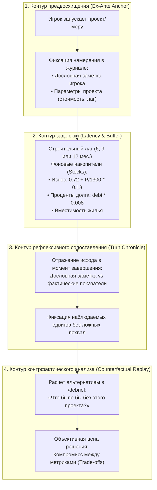

# Архитектура дидактического рефлексивного шока: Как симулятор Лоххаузена раскрывает пользователю его системные ошибки

**Автор**: `agy` (Antigravity Research Assistant / Domain Expert)  
**Дата**: 2026-09-12 (полностью выверено по `src/model.js`, `docs/party-analysis-audit-20260911.md` и `docs/project-counterfactual-verification.md`)  
**Основание**: Дитрих Дёрнер (*Die Logik des Mißlingens*, гл. 2, 7, 8), исследования Стефана Штрошнайдера по когнитивным искажениям в Lohhausen, математическая модель `src/model.js`  
**Назначение**: Ответ на фундаментальный вопрос проекта: *«Что самое важное должно быть в проекте, чтобы пользователь понял свои ошибки?»*.

---

## 1. Фундаментальный парадокс осознания ошибок по Дёрнеру

В классических экспериментах с симуляцией Лоххаузена (1981–1989 гг.) Дёрнер зафиксировал парадоксальный феномен:
> **Подавляющее большинство участников, приведших город к глубокому кризису (депопуляция, банкротство, технологический коллапс), завершали эксперимент с непоколебимым убеждением, что действовали абсолютно разумно, а крах вызван «непредсказуемостью обстоятельств» или «нереалистичностью компьютерной модели».**

Почему человек не понимает своих ошибок в комплексной динамической системе?

### 1.1. Четыре барьера психологической самозащиты

1. **Когнитивное иммунизирующее обусловливание (Immunisierende Konditionierung)**:
   Игрок спасает свою ментальную модель, изобретая внешние помехи: *«Мое решение вложить 460 тыс. в модернизацию фабрики было правильным, просто потом сложились неблагоприятные условия»*.
2. **Слепота к временным лагам (Time-Lag Blindness)**:
   Причина и следствие разделены временем. В месяце 15 игрок начинает проект; в месяце 24 возникает долговой пик; в месяце 36 проявляются демографические сдвиги. Человек связывает события 36-го месяца исключительно с решениями месяца 35, упуская из виду спусковой крючок 15-го месяца.
3. **Искажение ретроспективной памяти (Hindsight Bias / «Я так и знал»)**:
   Человеческая память пластична. При наступлении непредвиденного исхода мозг задним числом подгоняет воспоминание об исходных ожиданиях, создавая иллюзию предвидения: *«Да, безработица выросла, но я и предполагал высвобождение рабочих рук»*.
4. **Линейная одномерная редукция (Reduktion von Komplexität)**:
   Игрок оценивает систему по одной любимой переменной: *«Казна в плюсе — значит, я успешен»* или *«Оборудование на 100% — значит, фабрика спасена»*, игнорируя возникновение структурной безработицы или дефицита жилья.

---

## 2. Что самое важное должно быть в проекте?

> **Самое важное в проекте — это «Когнитивное зеркало» (Cognitive Mirror): объективное и математически строгое столкновение субъективных намерений игрока с системной реальностью через 4 взаимосвязанных контура.**

---

## 3. Архитектура «Когнитивного зеркала»: Четыре элемента

### Элемент 1. Предварительная фиксация замысла (Pre-Commitment Logging)
- **Проблема**: Без предварительной фиксации игрок легко переписывает свои намерения задним числом.
- **Решение**: При принятии решения о проекте (`startProject`, `src/model.js`, строка 77) симулятор фиксирует дословную заметку игрока в журнале (`journal.push({ month, type: 'project', title, note, project })`).
- **Значение**: Заметка сохраняется буквально (`translate="no"`), предотвращая ретроспективную рационализацию.

### Элемент 2. Честное отражение причинности (Causal Explanation Engine)
- **Проблема**: Если симулятор сообщает ложное «обслуживание компенсирует износ» при фактической потере оборудования, игрок погружается в иллюзию благополучия.
- **Решение**: Интегрированный модуль `explainStepCauses` (`src/causal.js`) честно разделяет:
  * Наблюдаемое изменение оборудования за фактический интервал журнала (`monthsElapsed`);
  * Текущий уровень расходов на обслуживание;
  * Завершение проектов модернизации в данном интервале;
  * Насыщение на границах (0% или 100%).

### Элемент 3. Контрфактическое доказательство (Counterfactual Replay)
- **Проблема**: Игрок склонен оправдываться: *«У меня не было другого выхода! Без этого проекта город бы не справился!»*.
- **Решение**: Модуль `src/counterfactual.js` проводит точный перерасчет партии при исключении конкретного завершенного проекта:
  
  | Показатель (к месяцу 120) | Фактическая партия | Альтернатива без 2-й модернизации | Разница ($\Delta$) | Системный смысл |
  |:---|:---:|:---:|:---:|:---|
  | **Казна (тыс. марок)** | 2594.68 | 2592.79 | $+1.88$ | Модернизация за 460 тыс. окупилась за 55 мес. с чистым плюсом $+1.88$ тыс. |
  | **Оборудование (%)** | 100.0 | 100.0 | $0.0$ | К месяцу 74 оборудование достигло 100% в обоих вариантах благодаря обслуживанию |
  | **Выпуск (ед./мес.)** | 809.52 | 799.46 | $+10.06$ | Выпуск выше на 10 часов в месяц благодаря уровню модернизации |
  | **Безработные (чел.)** | 384.26 | 315.26 | $+69.00$ | **69 рабочих мест высвобождено из-за роста производительности!** |
  | **Удовлетворенность (баллы)** | 98.89 | 98.69 | $+0.20$ | Сводное благополучие практически идентично |

- **Результат**: Контрфакт наглядно демонстрирует, что за финансовый выигрыш в $+1.88$ тыс. марок город заплатил высвобождением 69 рабочих мест. Это объективный системный компромисс (*Trade-off*), разрушающий иллюзию однозначной победы.

### Элемент 4. Трассировка замкнутых петель (Causal Feedback Tracing)
- Симулятор показывает петли обратной связи (CLD), объясняющие структуру взаимосвязей:
  1. $\text{Модернизация} \implies \text{Производительность труда} \uparrow$
  2. $\text{Производительность} \uparrow \text{ при том же спросе} \implies \text{Потребность в фабричных рабочих} \downarrow$
  3. $\text{Высвобождение рабочих} \implies \text{Рост безработицы} \uparrow$
  4. $\text{Для нейтрализации безработицы} \implies \text{Необходимость расширения сферы услуг или туризма}$.
- Пользователь осознает: локальное улучшение одного параметра (эффективность фабрики) без упреждающего развития альтернативной занятости порождает социальный дисбаланс.

---

## 4. Сравнительная матрица: Обычные игры vs Лоххаузен

| Измерение | Обычная игра / Стратегия | Обучающий симулятор Лоххаузена (Дёрнер) |
|:---|:---|:---|
| **Оценка результата** | Бинарная: «Победа / Поражение» или линейный счет очков. | **Многокритериальная**: 5 измерений системного радара, группы рабочих, семей и пенсионеров. |
| **Отношение к целям** | Внешние директивные маркеры. | **Сверка с собственными намерениями игрока** (дословный журнал гипотез). |
| **Временные лаги** | Мгновенные эффекты («кликнул — получил»). | **Реалистичные лаги** (6–12 мес.) с накоплением скрытых сдвигов в накопителях. |
| **Рефлексия ошибок** | Текстовый упрек: «Вы проиграли». | **Контрфактическая декомпозиция**: расчет «Что было бы без этого проекта». |
| **Побочные эффекты** | Случайные события (RNG). | **Детерминированные нелинейные контуры**, связывающие капитал, труд и бюджет. |

---

## 5. Вывод для развития симулятора

Чтобы пользователь симулятора Лоххаузена понял свои ошибки, проект должен:
1. **Фиксировать исходный замысел дословно** (сохранять исходную формулировку заметки в журнале).
2. **Не маскировать скрытый износ** (честно сообщать скорость потери оборудования и текущий уровень расходов).
3. **Обнажать объективную цену решений** (показывать высвобождение рабочих при росте производительности).
4. **Давать точный расчет альтернативы** (детерминированное контрфактическое сравнение в `/debrief`).
