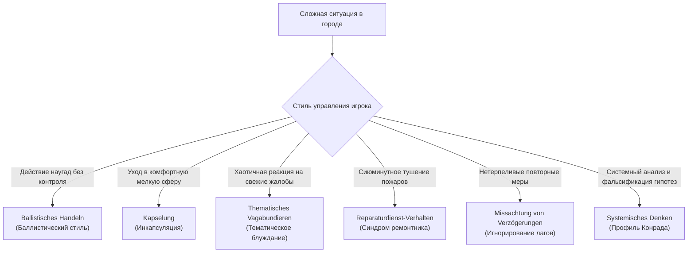

# Дидактическое руководство по веб-симулятору Лоххаузена
**Научно-методическое пособие по книге Дитриха Дёрнера «Die Logik des Mißlingens»**

*Разработано руководителем проекта (`dorner_scenarios`) при участии команды исследователей и разработчиков (`agy`, `codex`, `dorner_analyst`, `debrief_agent`).*

---

## Введение: Чему учит симулятор Лоххаузена

В классическом психологическом эксперименте конца 1970-х годов немецкий психолог Дитрих Дёрнер (Dietrich Dörner) и его коллеги из Бамбергского университета исследовали способность людей управлять сложными, динамическими, многосвязными и непрозрачными системами. Участникам предлагалось на 10 виртуальных лет занять пост бургомистра вымышленного города Лоххаузен с населением около 3700 человек.

Большинство испытуемых потерпели неудачу не из-за недостатка интеллекта или злого умысла, а из-за фундаментальных особенностей человеческой психики, сформировавшейся для выживания в простых, линейных и непосредственных ситуациях. Настоящий веб-симулятор воспроизводит эту динамику, предоставляя обучающую среду для выработки **системного мышления** (*Systemdenken*).

---

## 1. Системные контуры и архитектура взаимодействия

В отличие от традиционных экономических игр, где ресурсы складываются аддитивно, в Лоххаузене действует сеть обратных связей (Causal Feedback Loops), содержащих как усиливающие (положительные), так и балансирующие (отрицательные) петли, а также линии задержки (Time Lags).

### 1.1. Петля муниципальных налогов и привлекательности (Балансирующий контур B1)
$$\text{Налог} \uparrow \longrightarrow \text{Казна} \uparrow \longrightarrow \text{Благополучие жителей} \downarrow \longrightarrow \text{Привлекательность города} \downarrow \longrightarrow \text{Миграционный отток} \uparrow \longrightarrow \text{Налоговая база} \downarrow$$
- **Дидактический урок**: Попытка решить бюджетный дефицит механическим взвинчиванием налоговой ставки выше 15–18% запускает отток квалифицированных кадров, снижает покупательную способность и в долгосрочной перспективе сжимает поступления в казну.

### 1.2. Петля часовой фабрики и производственного капитала (Усиливающий/Балансирующий контур R1/B2)
$$\text{Обслуживание оборудования} \uparrow \longrightarrow \text{Состояние станков} \uparrow \longrightarrow \text{Производительность труда} \uparrow \longrightarrow \text{Выпуск часов} \uparrow \longrightarrow \text{Выручка от продаж} \uparrow \longrightarrow \text{Казна} \uparrow$$
- **Задержка износа**: Оборудование деградирует непрерывно. Если расходы на обслуживание опускаются ниже точки компенсации (~8–10 тыс. марок/мес.), износ накапливается скрытно.
- **Инвестиционный проект модернизации**: Требует единовременных инвестиций, длится **9 месяцев** и добавляет **+12 пунктов** к качеству оборудования.

### 1.3. Петля жилищного строительства и временного лага (Линия задержки 12 месяцев)
$$\text{Строительство жилья} \longrightarrow \text{Временной лаг 12 мес.} \longrightarrow \text{Прирост фонда (+60 мест)} \longrightarrow \text{Ликвидация дефицита} \longrightarrow \text{Рост благополучия}$$
- **Дидактический урок**: При дефиците жилья бургомистр не видит эффекта в первые 11 месяцев после начала стройки. Нетерпеливый игрок запускает повторные стройки, истощая казну («Игнорирование запаздывания»).

### 1.4. Петля туризма и рекламы (Узкое горлышко емкости)
$$\text{Реклама туризма} \uparrow \longrightarrow \text{Спрос на отдых} \uparrow \quad (\text{ограничен емкостью кемпинга/отелей})$$
- **Дидактический урок**: Вливание бюджетных средств в рекламу при емкости в 20 мест дает нулевой экономический эффект и ведет к финансовому тупику. Сначала необходимо развернуть инфраструктуру (лаг 6 мес., +80 мест), и только затем масштабировать маркетинговые расходы.

---

## 2. Разбор исторических сценариев

Симулятор предлагает 4 канонических сценария с фиксированными целями и горизонтом:

| Сценарий | Горизонт | Стартовое состояние | Фокус обучения | Ключевая опасность |
|---|---|---|---|---|
| **1. Песочница Лоххаузена** | 120 мес. (10 лет) | Сбалансированное (казна 300, население 3700, станки 70%) | Комплексное гармоничное развитие всех секторов города | Синдром ремонтника, потеря долгосрочной перспективы |
| **2. Кризис фабрики** | 60 мес. (5 лет) | Станки 25%, износ критический, казна 150 | Преодоление промышленного коллапса, модернизация | Инкапсуляция: бегство в туризм вместо спасения фабрики |
| **3. Экологическая ловушка** | 48 мес. (4 года) | Казна 100, долг 200, спрос на туризм низок | Балансировка туристической инфраструктуры и бюджета | Траты на рекламу без мест в гостиницах («Рекламный мираж») |
| **4. Стресс-тест Дёрнера** | 120 мес. (10 лет) | Дефицит бюджета, станки 35%, жилой кризис | Антикризисное управление в условиях каскадных шоков | Баллистические решения, паническое перерегулирование |

---

## 3. Анатомия когнитивных ловушек мышления

Дёрнер выделил специфические стереотипы поведения, ведущие к краху:

### 3.1. Баллистический стиль (*Ballistisches Handeln*)
- **Поведение**: Игрок запускает дорогостоящий проект (например, модернизацию фабрики на 9 месяцев), но после его завершения ни разу не запрашивает отчет промышленного отдела и не проверяет, выросло ли производство.
- **Принцип Дёрнера**: Действие подобно артиллерийскому выстрелу — после нажатия на спуск управляющий больше не интересуется траекторией снаряда.

### 3.2. Инкапсуляция (*Kapselung*)
- **Поведение**: Столкнувшись с тяжелым, многофакторным кризисом на часовой фабрике, игрок полностью переключается на благоустройство кемпинга или закупку сувениров, игнорируя коллапс градообразующего предприятия.
- **Принцип Дёрнера**: Психологическая самозащита через бегство в область, где задачи кажутся простыми, понятными и гарантируют быстрый эмоциональный успех.

### 3.3. Тематическое блуждание (*Thematisches Vagabundieren*)
- **Поведение**: Каждый ход игрок меняет приоритет: месяц 1 — поднять налоги, месяц 2 — снизить налоги и вложить в медицину, месяц 3 — урезать медицину и строить жилье.
- **Принцип Дёрнера**: Отсутствие иерархии целей приводит к тому, что внимание захватывается последним поступившим сигналом или жалобой.

### 3.4. Синдром ремонтника (*Reparaturdienst-Verhalten*)
- **Поведение**: Реагирование исключительно на индикаторы в «красной зоне» без понимания порождающих причин.
- **Принцип Дёрнера**: Бургомистр работает не как стратег, а как аварийная бригада, затыкающая прорывы труб в подвале, пока здание разрушается от фундамента.

### 3.5. Игнорирование запаздывания (*Missachtung von Verzögerungen*)
- **Поведение**: Не дождавшись окончания срока строительства (лаг 12 месяцев), игрок решает, что меры не работают, и начинает вторую, третью и четвертую стройку, загоняя бюджет в долговую яму.

---

## 4. Пятиосевой радар системного здоровья и критический порог (40%)

Для наглядного отслеживания системного баланса (*Systemgleichgewicht*) в симуляторе реализован пятиосевой радар:
1. **Финансовая устойчивость** (соотношение казны и долговой нагрузки).
2. **Занятость и рынок труда** (доля трудоустроенного населения, баланс рабочих мест).
3. **Общее благополучие** (удовлетворенность рабочих, служащих, пенсионеров и торговцев).
4. **Обеспеченность жильем** (дефицит жилого фонда относительно численности семей).
5. **Промышленный потенциал** (состояние оборудования и рентабельность фабрики).

### Дидактический порог (40%) и системные риски
- В центре диаграммы расположено **красное пунктирное кольцо ориентира (40%)**.
- Это дидактический визуальный ориентир для игрока, наглядно иллюстрирующий проседание сфер города в опасную зону. В коде `model.js` нет искусственного бинарного триггера мгновенного краха при пересечении отметки 40%; кольцо выполняет сигнальную функцию: одновременное проседание нескольких осей предупреждает игрока о каскадных системных рисках (падение спроса, дефицит бюджета, эмиграция населения).

---

## 5. Методология рефлексивного обучения: Дневник намерений

Дёрнер доказал, что простого накопления игрового опыта недостаточно для выработки системного мышления. Необходима **экспликация гипотез** до совершения действия.

В симуляторе Лоххаузена внедрен инструмент:
1. **Формулирование ожидания**: При запуске проекта или изменении тарифов игрок записывает в Дневник гипотезу: «Ожидаю, что ввод жилья через 12 месяцев снизит дефицит до 0 и поднимет благополучие рабочих до 90%».
2. **Автоматическая сверка «Ожидание vs Реальность»**: В месяц завершения проекта движок сопоставляет фактические показатели с исходным прогнозом игрока.
3. **Итоговый дебрифинг (Debriefing Engine)**: В конце игры формируется подробный отчет с профилированием стиля управления (сравнение с эталонами Конрада и Маркуса) и практическими рекомендациями.

---

## 6. Мультиязычный терминологический стандарт

| Понятие (RU) | Немецкий оригинал Дёрнера (DE) | Английский (EN) | Французский (FR) |
|---|---|---|---|
| Баланс системы | Systemgleichgewicht | System Balance | Équilibre du système |
| Радар здоровья города | Lohhausen-Gesundheitsradar | Lohhausen Health Radar | Radar de santé de Lohhausen |
| Профиль города | Stadtsystemprofil | City Profile | Profil de la ville |
| Критический порог (40%) | Kritische Schwelle (40%) | Critical Threshold (40%) | Seuil critique (40%) |
| Кумулятивный крах | Kumulativer Zusammenbruch | Cumulative Collapse | Effondrement cumulatif |
| Баллистический стиль | Ballistisches Handeln | Ballistic Action | Action balistique |
| Инкапсуляция | Kapselung | Encapsulation | Encapsulation |
| Тематическое блуждание | Thematisches Vagabundieren | Thematic Vagabonding | Vagabondage thématique |
| Синдром ремонтника | Reparaturdienst-Verhalten | Repairman Syndrome | Syndrome du dépanneur |
| Игнорирование задержек | Missachtung von Verzögerungen | Lag Ignorance | Ignorance des délais |
| Часовая фабрика | Uhrenfabrik | Watch factory | Fabrique d'horlogerie |
| Модернизация станков | +12 Zustandspunkte der Maschinen | +12 equipment condition points | +12 points d'état de l'équipement |
