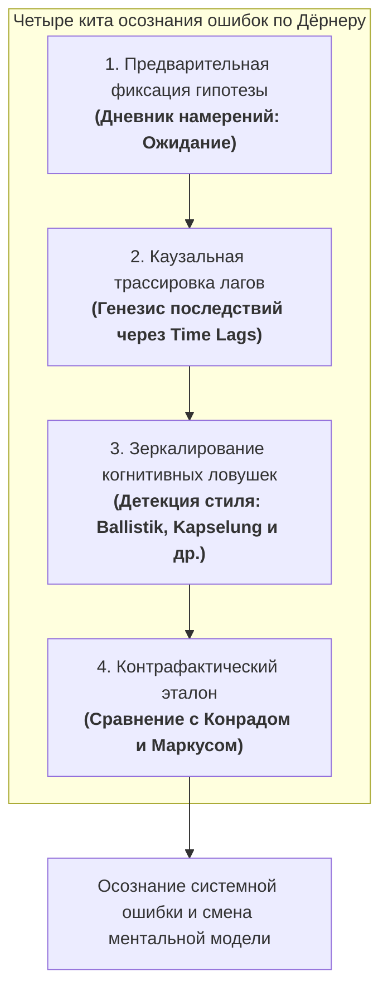

# Архитектура осознания ошибок в сложных системах: Как симулятор Лоххаузена преодолевает когнитивную слепоту управляющего

**Научно-методологическая записка по трудам Дитриха Дёрнера («Die Logik des Mißlingens»)**
*Автор: Руководитель проекта `dorner_scenarios` (Project Lead)*
*Дата: 2026-09-09*

---

## 1. Фундаментальный парадокс: Почему люди не понимают своих ошибок в сложных средах?

В классических экспериментах с симулятором Лоххаузена (Бамбергский университет) Дитрих Дёрнер выявил поразительный феномен: **даже после полного краха города большинство участников были убеждены, что действовали абсолютно правильно и логично**.

Они винили «случайные кризисы», «неадекватных жителей», «дефектную компьютерную программу» или «непредвиденные обстоятельства». Ни один из участников спонтанно не сказал: *«Я сам разрушил систему 10 месяцев назад своим неосторожным налоговым решением»*.

Дёрнер выделил три фундаментальных психологических барьера, блокирующих осознание ошибок:

1. **Разрыв между причиной и следствием во времени и пространстве (Time Lags & Spatial Decoupling)**:
   - В простых системах (нажатие выключателя, бросок мяча) обратная связь наступает за доли секунды и локализована в одном месте.
   - В сложных системах (город Лоххаузен) решение, принятое в секторе A в месяце 2 (например, взвинчивание налогов), дает разрушительный эффект в секторе B лишь в месяце 14 (дефицит специалистов на часовой фабрике из-за отложенной эмиграции). Человеческий мозг эволюционно не приспособлен связывать события с лагом в год: в месяце 14 игрок винит директора фабрики, а не свое прошлогоднее налоговое решение.

2. **Эвристика «заднего ума» (Hindsight Bias) и самооправдание (Selbstwertschutz)**:
   - Психика человека активно защищает образ «компетентного я». Если до начала действия прогноз не был жестко записан, память ретроспективно переписывается: *«Я так и предполагал, это был контролируемый риск»*. Без экспликации ожиданий игрок искренне верит, что никогда не ошибался.

3. **Линейно-цепочечное мышление вместо сетевого (Lineares Kausalitätsdenken)**:
   - Человек мыслит цепочками: $A \rightarrow B \rightarrow C$. В сложных же системах действуют замкнутые петли с нелинейным откликом: $A$ влияет на $B$, $B$ влияет на $C$, но $C$ через задержку меняет само $A$. Не понимая кольцевой причинности, управляющий устраняет следствие, порождая лавину новых проблем.

---

## 2. Что самое главное должно быть в проекте для понимания ошибок?

Чтобы пользователь по-настоящему понял свои ошибки в симуляторе Лоххаузена, проект должен содержать не просто счет очков («Game Over: 45/100»), а **четырехкомпонентное Системное Зеркало Мышления (Reflexive Causal Mirror)**.

---

### Элемент 1: Эксплицитный контракт ожидания («Дневник намерений: Ожидание vs Реальность»)

> *«Тот, кто не сформулировал гипотезу до действия, никогда не сможет ее опровергнуть».* — Дитрих Дёрнер

- **Как это работает в симуляторе**:
  Перед запуском проекта или крупным изменением тарифов интерфейс побуждает игрока записать в Дневник намерений (`journalView`):
  1. *Какова точная цель решения?*
  2. *Какой количественный результат ожидается и к какому месяцу (с учетом лага)?*
  3. *Какие побочные эффекты признаются допустимыми?*
- **Момент истины**: В месяц завершения проекта (через 6, 9 или 12 месяцев) движок ретроспективы (`src/debrief.js: verifyHypotheses`) извлекает первоначальную запись игрока и сопоставляет ее с реальными приборами:
  - *Вы ожидали*: Рост благополучия до 90% и дефицит жилья 0.
  - *Реальность*: Дефицит жилья действительно ликвидирован, но казна упала в долг -15 000, а проценты по кредиту вынудили урезать медицину, уронив удовлетворенность до 42%.
- **Психологический эффект**: Hindsight bias мгновенно разрушается. Игрок видит собственную цитату полугодовой давности и не может заявить: «Я так и планировал».

---

### Элемент 2: Каузальная трассировка отдаленных последствий (Traceability of Time Lags)

- **Как это работает в симуляторе**:
  В дайджесте хода (`src/causal.js: causalDigestSection`) и разборе кризисов система не просто констатирует факт беды («Падение производства на 30%»), а **восстанавливает причинно-следственную цепочку во времени**:
  $$\text{Месяц 2: Налог 24%} \xrightarrow{\text{лаг 5 мес.}} \text{Месяц 7: Отток специалистов} \xrightarrow{\text{лаг 4 мес.}} \text{Месяц 11: Недокомплект смен} \xrightarrow{} \text{Месяц 14: Простой станков}$$
- **Психологический эффект**: Разрывается иллюзия «случайного сбоя». Пользователь начинает физически ощущать инерцию системы и понимать, что сегодняшние бедствия — это плоды его собственных действий годовой давности.

---

### Элемент 3: Зеркалирование когнитивных стереотипов, а не сухой счет (Cognitive Trap Diagnosis)

Вместо абстрактной оценки игроку предъявляется диагноз его стиля мышления на основе книги Дёрнера:

1. **Баллистический стиль (*Ballistisches Handeln*)**:
   - *«Вы запустили 3 инвестиционных проекта на сумму 250 тыс. марок, но после их окончания ни разу не запросили отчет профильного ведомства и не проверили отдачу. Вы действовали как артиллерист: выстрелил и забыл»*.
2. **Инкапсуляция (*Kapselung*)**:
   - *«На фоне тяжелейшего износа станков (22%) и банкротства фабрики вы потратили 8 месяцев и 60% решений на обустройство туристического кемпинга. Вы сбежали в комфортную второстепенную тему от решения системного кризиса»*.
3. **Синдром ремонтника (*Reparaturdienst-Verhalten*)**:
   - *«90% ваших действий были реакцией на последнюю мигающую красную лампочку. Вы не управляли городом упреждающе, а работали аварийной бригадой, затыкающей прорывы труб»*.
4. **Игнорирование запаздываний (*Missachtung von Verzögerungen*)**:
   - *«Не дождавшись окончания 12-месячного срока строительства жилья, вы приняли еще 3 решения о стройке, раскачав систему и обрушив казну в долговой маховик»*.

---

### Элемент 4: Контрафактический эталон («А как можно было иначе?»)

- **Проблема**: Столкнувшись с неудачей, игрок склонен считать, что симуляция «непроходима» или несправедлива.
- **Решение**: Графическое сопоставление траектории игрока с двумя эталонными профилями из глав 2 и 7 книги Дёрнера:
  - **Конрад (*Systemic Thinker*)**: Достиг баланса в тех же начальных условиях за счет сдержанных налогов, ранней модернизации фабрики и терпеливого ожидания завершения строительных лагов.
  - **Маркус (*Ballistic & Reactive Actor*)**: Развалил город через гиперактивность, метания между жалобами и игнорирование долга.
- **Психологический эффект**: Игрок видит на графике (`renderBenchmarkComparisonChart`), где именно его кривая откололась от Конрада и повторила судьбу Маркуса. Оправдание «сценарий был обречен» отпадает само собой.

---

## 3. Резюме: Золотое правило образовательного симулятора

> **Самое важное в проекте — не наказать пользователя за ошибку и не поставить ему оценку, а сделать так, чтобы он увидел скрытые петли обратной связи, время задержки своих решений и собственную когнитивную ловушку в момент выбора.**

Когда пользователь восклицает:
*«Подождите, так это я сам 10 месяцев назад вызвал отток людей, когда пожадничал и задрал налог, думая, что решаю проблему бюджета?!»* —
**в этот момент обучающая цель симулятора Лоххаузена полностью достигнута.**
